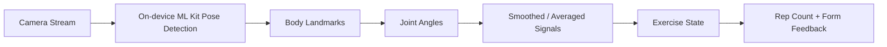

# RepRush

**Camera-based calisthenics tracking with a territory-game layer.**

RepRush is a Flutter mobile prototype that uses **on-device Google ML Kit Pose Detection** to turn bodyweight exercises into tracked repetitions, form feedback, and game progression. Camera frames stay on-device; video is not uploaded.

## Current Implementation

The computer-vision pipeline currently supports three exercises:

- Squats
- Push-ups
- Pull-ups

The app extracts body landmarks from the camera stream and uses **joint-angle based movement logic** to detect exercise states and repetitions. The implementation also uses temporal averaging/smoothing and a calibrated rest-state angle to reduce instability in noisy frame-by-frame landmark estimates.

> **Accuracy:** a formal accuracy benchmark has not yet been measured, so no accuracy percentage is claimed here.

## How It Works



The early prototype encountered frame-rate instability during pose tracking. Smoothing/averaging and rest-state calibration were used to make the tracking behavior more stable in practice.

## Privacy

Pose detection runs on-device. The application does not upload the user's workout video. Only the workout evidence required by the broader game system is used outside the camera-processing path.

## Technology Stack

| Area | Technology |
|---|---|
| Mobile | Flutter, Dart |
| Pose estimation | Google ML Kit Pose Detection |
| Camera | Flutter Camera plugin |
| State management | Riverpod |
| Backend | Supabase |
| Maps / location | Flutter Map, Geolocator |

## Project Status

RepRush is an active hackathon prototype. The current CV scope is deliberately focused on getting reliable exercise-state tracking working for three movements before expanding the exercise library and adding formal evaluation.

## Run Locally

```bash
flutter pub get
flutter run
```

Useful development commands:

```bash
flutter analyze
flutter test
dart format .
```

## Documentation

- [Product requirements](docs/requirements.md)
- [API and evidence contract](docs/api-contract.md)
- [Team roles and project structure](docs/roles.md)
